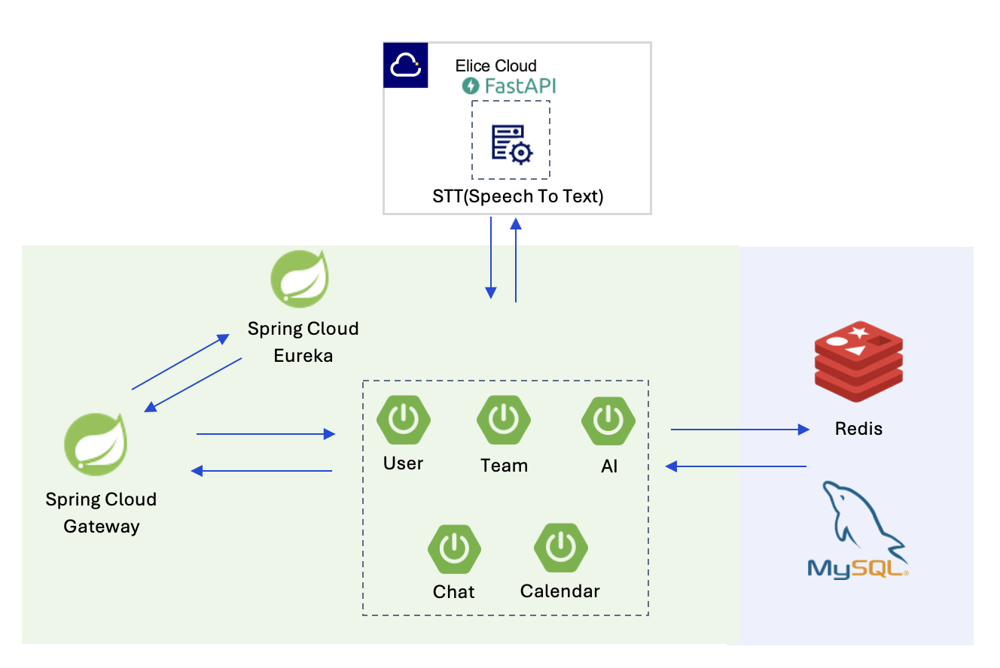

# 👨‍💻 업무 협업 도구 Sqace

## 목차
- [개발기간 및 작업관리](#1-개발기간-및-작업관리)
- [팀원 소개](#2-팀원-소개)
- [개발 환경](#3-개발-환경)
- [프로젝트 개요](#4프로젝트-개요)
- [프로젝트 주요 기능](#5프로젝트-주요-기능)
- [아키텍처](#6-아키텍처)

---

## 1. 개발기간 및 작업관리

### 개발 기간
- 프로젝트 기간 : 2024.10 ~ 2024.12

### 작업 관리
- 매주 오전 데일리 스크럼을 진행하여 진행상황을 공유하며 진행하였습니다.
---

## 2. 팀원 소개

### 팀원 소개
|                                                           **[PM]FrontEnd**                                                           |                                                           **[PL]BackEnd**                                                            |
 |:------------------------------------------------------------------------------------------------------------------------------------:|:------------------------------------------------------------------------------------------------------------------------------------:|
|                                                               **한상결**                                                                |                                                               **장해준**                                                                |
| [   @sanggyeol1](https://github.com/sanggyeol1) | [   @HaejunJang](https://github.com/HaejunJang) |

 

|                                                           **FrontEnd**                                                            |                                                        **FrontEnd**                                                         |                                                       **BackEnd**                                                        |                                                                   **BackEnd**                                                                    |                                                           **Infra**                                                            |
|:---------------------------------------------------------------------------------------------------------------------------------:|:---------------------------------------------------------------------------------------------------------------------------:|:------------------------------------------------------------------------------------------------------------------------:|:------------------------------------------------------------------------------------------------------------------------------------------------:|:------------------------------------------------------------------------------------------------------------------------------:|
|                                                              **박석종**                                                              |                                                           **최예원**                                                           |                                                         **박가현**                                                          |                                                                     **임채윤**                                                                      |                                                            **하재웅**                                                             |
| [   @PSeokJong](https://github.com/PSeokJong) | [   @yeonge2](https://github.com/yeonge2) | [   @chan9e](https://github.com/chan9e) | [   @Limchaeyoon425](https://github.com/Limchaeyoon425) | [   @qlfyd123](https://github.com/qlfyd123) |
 

## 3. 개발 환경

- **Front-end** : React, Javascript, Zustand
- **Back-end** : JAVA 17, SpringBoot 3.3.4, SpringCloud 2023.0.3, Spring Data JPA 3.3.4, JWT 0.11.2, Lombok, MySQL
- **Infra** : OracleCloud, Kubernetes, Jenkins, Nginx, ELKStack, Minio, Kafka
- **디자인** : [Figma](https://www.figma.com/design/UJc2HrfLc2316CC832Abof/KEA-5%EA%B8%B0-Sqace-%ED%94%84%EB%A1%9C%EC%A0%9D%ED%8A%B8-%EB%94%94%EC%9E%90%EC%9D%B8?node-id=0-1&t=wLbp4EW7uf094RAx-0)

---

## 4.프로젝트 개요

## 🔹 프로젝트 소개
- 우리는 업무 협업에서 자주 사용하는 지라(Jira), 슬랙(Slack), 디스코드(Discord)와 같은 도구들이 각각 다른 플랫폼에 흩어져 있는 점을 불편하게 느꼈습니다. 이러한 기능들을 하나의 공간에서 통합적으로 활용할 수 있는 Sqace라는 워크스페이스를 만들고자 프로젝트를 시작했습니다.

## 🔹 프로젝트 목적
- 업무 관리 : Jira와 연동하여 개인 단위의 태스크 관리
- 팀 소통 : 실시간 그룹 채팅방 및 음성 통화 기능 제공
- AI 활용 : STT모델을 통한 음성 변환 -> 변환된 문자를 기준으로 음성회의 내용 요약 제공

---

## 5.프로젝트 주요 기능

### 1. 팀 및 멤버 관리
- **팀 생성 및 관리** : 사용자가 새로운 팀을 생성하고 관리 가능
- **멤버 초대 및 삭제** : 이메일 기반으로 팀원 초대, 필요시 멤버 삭제
- **접속 상태 확인** : 팀원들의 온라인/오프라인 상태 표시

### 2. 실시간 커뮤니케이션
- **팀 메신저** : Slack처럼 팀 단위 채팅방 제공
- **파일 공유** : 팀 워크스페이스에 이미지/파일 업로드 및 확인가능

### 3. 음성회의 및 AI 요약
- **실시간 음성 통화** : Discord와 유사한 음성회의 기능 제공(WebRTC기반 API 활용)
- **STT 변환** : 회의 음성을 Speech-to-Text 모델을 통해 텍스트로 변환
- **AI요약(목표 기능)** : 변환된 텍스트를 AI가 요약하여 회의록 생성

### 4. 업무 관리 및 외부 연동
- **TODO 관리** : 개인 및 팀 단위 할 일 등록 및 진행 상태 표시
- **Jira 연동** : 개인 단위 태스크를 Jira로 푸시하여 업무 관리와 연계

### 5. 인프라 및 보안
- **JWT 기반 인증** : 로그인 및 API 요청시 보안 강화를 위한 JWT 인증 적용
- **파일 저장소** : MinIo 스토리지를 통한 안정적인 파일 업로드/다운로드 관리
- **MSA 서비스 관리** 
  - **로컬 개발 단계** : Spring Cloud Gateway와 Eureka를 활용하여 API Gateway 및 Service Discovery를 구현하고, MSA구조 학습
  - **운영 단계** : Kubernetes 환경에서 CoreDNS와 Ingress Controller로 서비스 디스커버리와 라우팅을 대체, Spring Cloud기반 구조를 K8s 네이티브 방식으로 확장

---

## 6. 아키텍처

